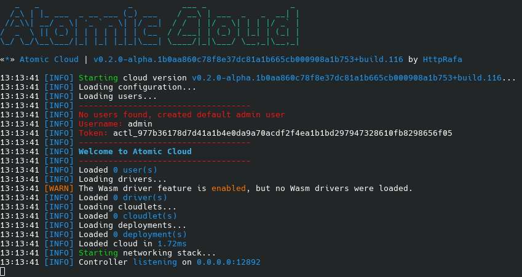

# Docker Installation (Recommended)

The most straightforward method to install the controller is by utilizing a Docker image. Follow the steps below to set it up using Docker Compose:

## Step 1: Create the `docker-compose.yml` File
First, use a text editor to create the `docker-compose.yml` file:
```bash
nano docker-compose.yml
```
Next, add the following content to the file:
```yaml
services:
  controller:
    image: ghcr.io/httprafa/atomic-cloud:latest
    ports:
      - "12892:12892"
    environment:
      - PTERODACTYL=true # Enable Pterodactyl driver installation
    volumes:
      - ./logs:/app/logs
      - ./auth:/app/auth
      - ./configs:/app/configs
      - ./cloudlets:/app/cloudlets
      - ./deployments:/app/deployments
      - ./drivers:/app/drivers
```

## Step 2: Start the Container
To start the container, execute the following command:
```bash
docker compose up
```

## Step 3: Retrieve the Admin Token
Upon the initial run of the controller, an admin token will be displayed. This token is required to connect using the CLI. For further details, refer to [How to use the CLI](/cli/).


## Step 4: Retrieve the Admin Token Later (If Needed)
In case you lose the token, it can be retrieved from the default admin user's file located in the `auth/users` directory.