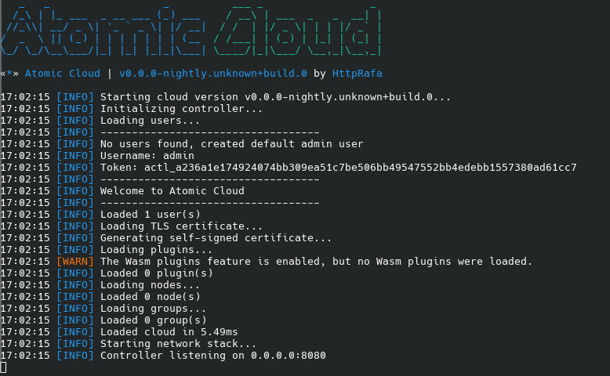

## Retrieve the Admin Token on First Launch

When you run the controller for the first time, an admin token will be displayed in the console. You will need this token to connect via the CLI. For more information, please refer to the [How to use the CLI](../cli/index.md) guide.

## Retrieve the Admin Token After the First Launch

If you lose the token after the initial launch, you can retrieve it from the default admin user's file. The file is located in the `users` directory within your controller's installation folder.