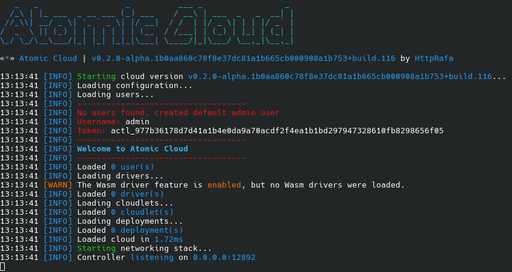

## Retrieve the Admin Token on First Launch
When you run the controller for the first time, an admin token will be displayed. You will need this token to connect via the CLI. For more information, see [How to use the CLI](/cli/).

## Retrieve the Admin Token After the First Launch
If you lose the token, you can retrieve it from the default admin user's file, located in the `auth/users` directory.
